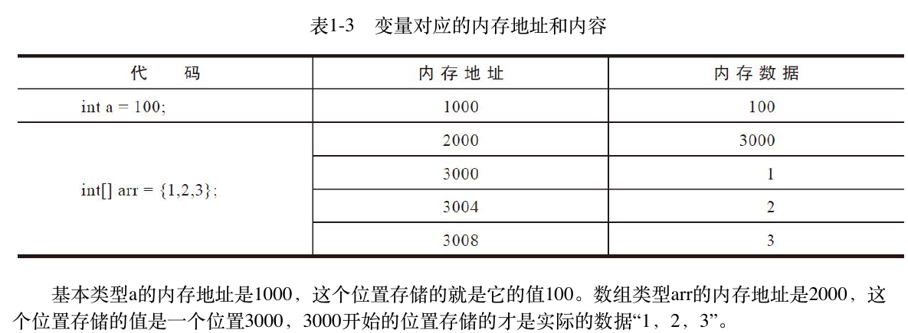

## Part1 编程基础与二进制

### 第一章 编程基础

#### 1.1 数据类型和变量

#### 1.2 赋值
* **基本数据类型和数组类型**
* **数字常量默认是int, 小数常量默认是double**
  `long a = 3232343433L` 
  `float f = 333.33f`
* **数组类型和基本类型内存空间表示**
  
  > 为什么数组要用两块空间?
#### 1.3 基本运算
* `long a = 2147483647*2` 和 `long a = 2147483647*2L`
* `float f = 0.1f * 0.1f;`
 > 本节问题:
 > 1.正整数相乘的结果居然出现了负数?
 > 2.非常基本的小数运算结果居然不精确?
 > 3.字符类型也可以进行算术运算和比较?

 #### 1.4 条件执行
 * 条件跳转和无条件跳转
 * 跳转表

#### 1.5 循环
* 4种循环: while; do/while; for; forearh
* break和continue
* 实现原理：条件跳转和无条件跳转

#### 1.6 函数
* 数组作为参数传递
* 可变长度参数(...)-->数组参数
* 函数重载:同一个类中函数名相同但参数不同
* 参数传递：自动类型转换, Java编译器寻找最匹配的函数

#### 1.7 函数调用的基本原理
* **通过栈来存储相关数据：**
1) 参数如何传递?
2) 函数如何知道返回什么地方?
3) 函数结果如何传给调用方?
> 存放这些数据的内存叫栈. 栈一般是从高位地址向低位地址扩展，即栈底的内存地址是最高的，栈顶的是最低的。
* **函数调用内存分配(堆栈调用图)**
> 定义一个变量就会分配一块内存，但我们并没有具体谈什么时候分配内存，具体分配在哪里,什么时候释放内存。 函数中的参数函数内定义的变量,都分配在栈中,这些变量只有在函数调用的时候才分配,而且在调用结束后就释放了(主要针对基本数据类型)

* **数组和对象的内存分配**