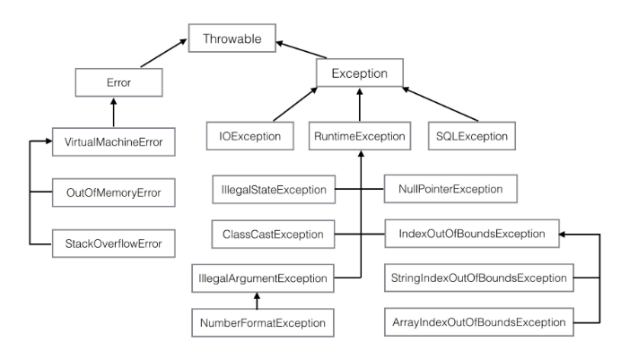

## Part2 面向对象

### 第6章 异常
> 程序在运行过程中出现错误，有的是外部原因如网络，有的是内部原因如内存不够，更多的是程序的编程错误，比如变量未初始化就直接调用实例方法

#### 6.1 初识异常
* **NullPointerException**(空指针异常)
```java
package com.xinyue.part2;

public class ExceptionTest {
    public static void main(String[] args) {
        String s = null;
        s.indexOf("a");
        System.out.println("end");
    }
}
```
输出为:
```
Exception in thread "main" java.lang.NullPointerException
	at com.xinyue.part2.ExceptionTest.main(ExceptionTest.java:6)
```
上述代码在第6行发生了空指针异常(s为null), 由于用户没有自定义异常处理的程序，所以执行Java默认的异常处理机制：打印异常栈信息到屏幕，并退出程序，所以最后一行代码没有执行。

* **自己捕获异常** <br>
  对于上述默认异常异常栈信息可能不太直观和友好，这时我们可以自己捕获异常
  ```java
    package com.xinyue.part2;

    public class ExceptionTest {
        public static void main(String[] args) {
            try {
                String s = null;
                s.indexOf("a");
                System.out.println("end");
            } catch(NullPointerException e) {
                System.out.println("字符串为null");
                e.printStackTrace();
            }
        }
    }
    ```
    输出
    ```
    字符串为null
    java.lang.NullPointerException
        at com.xinyue.part2.ExceptionTest.main(ExceptionTest.java:7)
    ```
  使用`try/catch`捕获异常, 程序在执行到异常代码后会触发我们自定义的异常处理程序，执行catch里的内容，我们可以输出我们想要提示的信息，同时也可以通过e对象打印输出异常栈信息，执行完后，程序会继续执行catch后的内容，而不是直接退出。

#### 6.2 异常类
* **Throwable** <br>
  所有异常类的父类, 有4个构造方法
  ```java
  public Throwable()
  public Throwable(String message)
  public Throwable(String message, Throwable cause)
  public Throwable(Throwable cause) 
  ```
  `message`表示异常消息，cause表示触发该异常的其他异常。异常可以形成一个异常链，上层的异常由底层异常触发，cause表示底层异常。

* **异常类体系** <br>
  以Throwable为根，Java API中定义了非常多的异常类，表示各种类型的异常，部分类示意如下:<br>
  
  <br>
  >Error表示系统错误或资源耗尽，由Java系统自己使用，应用程序不应抛出和处理<br>
  Exception表示应用程序错误，它有很多子类，应用程序也可以通过继承Exception或其子类创建自定义异常

  * 检查和未检查异常 <br>
    `RuntimeException`及其子类为未检查异常 <br>
    Exception的其他子类和Exception自身则是checked exception (受检异常)，Error及其子类也是unchecked exception <br>
    checked还是unchecked，区别在于Java如何处理这两种异常，对于checked异常，Java会强制要求程序员进行处理，否则会有编译错误，而对于unchecked异常则没有这个要求.

* **自定义异常**
  ```java
  public class AppException extends Exception {
    public AppException() {
        super();
    }

    public AppException(String message,
            Throwable cause) {
        super(message, cause);
    }

    public AppException(String message) {
        super(message);
    }

    public AppException(Throwable cause) {
        super(cause);
    }
  }
  ```
  >和很多其他异常类一样，我们没有定义额外的属性和代码，只是继承了Exception，定义了构造方法并调用了父类的构造方法。

  
