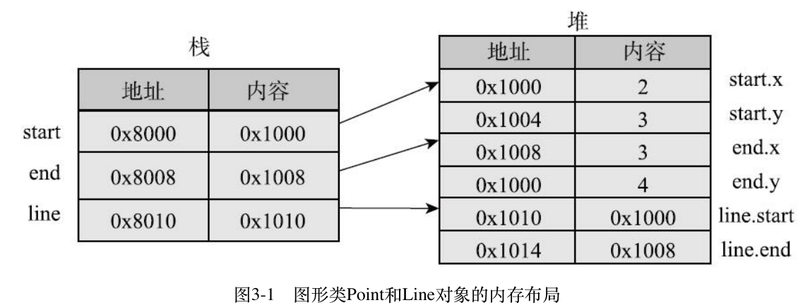

## Part2 面向对象
  
___
### 第3章 类的基础
  
  
#### 3.1 类的基本概念
  
* 实例变量(方法)和类变量(方法)区别
* 对象内存分配
  > 和数组变量类似，都有两块内存：一块存放实际内容，一块存放实际内容的位置。声明变量本身只会分配存放位置的内存空间，这块空间还没有指向任何实际内容。(引用类型: 本身不存储数据，而只是存储实际内容的位置)
  
  `p = new Point()`: 至少做了两件事:
   1)分配内存,以存储新对象的数据。
   2)给实例变量设置默认值, **int类型默认为0**
  
* **变量初始化**
  **1. 修改实例变量默认值: 初始化代码块**
    ```java
    package com.xinyue.part2;
    class Point {
        public int x = 1;
        public int y;
        {
            y = 2;  //初始化代码块
        }
        public double distance() {
            return Math.sqrt(x*x+y*y);
        }
  
        public static void main(String[] args) {
            Point p = new Point();  //x, y默认为0
            // p.x = 2;
            // p.y = 3;    
            System.out.println(p.x + " " +p.y);
        }
    }
    //out: 1 2
    ```
    如上述代码，创建对象后在没有赋初值的情况下，x和y(初始化代码块)分别被修改了默认初始值.
  
  **2. 静态初始化代码块**
   ```java
    class Point {
        static int STATIC_ONE = 1;
        static int STATIC_TWO;
        //静态初始化代码块,在类加载的时候执行
        static {
            STATIC_TWO = 2; 
        }
  
        public int x = 1;
        public int y;
        {
            y = 2;  //初始化代码块
            STATIC_TWO = 3; //说明静态初始化先执行
        }
        public double distance() {
            return Math.sqrt(x*x+y*y);
        }
  
        public static void main(String[] args) {
            Point p = new Point();  //x, y默认为0
            // p.x = 2;
            // p.y = 3;    
            //System.out.println(p.x + " " +p.y);
            System.out.print(Point.STATIC_ONE + " " + Point.STATIC_TWO);
        }
    }
  
    //out: 1 3
   ```
   如上述代码所示，静态初始化代码块在类加载的时候为变量赋予了初值，但为什么`STATIC_TWO`结果不是2呢，这是因为静态初始化代码块先于实例变量初始化代码块执行，实例初始化代码块然后修改了`STATIC_TWO`为3.
   **3. 静态初始化代码块与实例初始化代码块何时执行**
   ```java
   class Point {
        static int STATIC_ONE = 1;
        static int STATIC_TWO;
        //静态初始化代码块,在类加载的时候执行
        static {
            STATIC_TWO = 2; 
        }
  
        public int x = 1;
        public int y;
        {
            y = 2;  //初始化代码块
            STATIC_TWO = 3; //说明静态初始化先执行
        }
        public double distance() {
            return Math.sqrt(x*x+y*y);
        }
  
        public static void main(String[] args) {
            Point p;  //x, y默认为0
            // p.x = 2;
            // p.y = 3;    
            //System.out.println(p.x + " " +p.y);
            System.out.print(Point.STATIC_ONE + " " + Point.STATIC_TWO);
        }
    }
    //out: 1 2
   ```
   如上述，简单修改代码`Point p;`, 输出结果变为了`1,2`，注意这时并没有创建对象(实例)，所以实例初始化代码块并未执行，而静态初始化代码块在类加载的时候执行,这是在任何对象创建之前，且只执行一次。
<br/>
* 构造方法
  ```java
    public Point() {
        this(0, 0);
    }
  
    public Point(int x, int y) {
        this.x = x;
        this.y = y;
    }
  ```
  `this(0,0)`表示调用第二个构造方法，并传递参数0,0.
  > this的用法: 1)表示当前实例 2)用于在构造方法中调用其他构造方法
  
  1. 默认构造方法
  在没有定义任何构造方法时，Java编译器生成一个空的构造方法，但当用户定义了自己的构造方法，则不会生成。
  
  2. 私有构造方法(为什么需要?)
   (1) 不能创建类的实例,类只能被静态访问,如Math和Arrays类,它们的构造方法就是私有的。
   (2) 能创建类的实例，但只能被类的静态方法调用. (单例模式)
   (3) 只是用来被其他多个构造方法调用,用于减少重复代码。
  
* 类和对象的生命周期
  1. 当第一次通过new创建一个类的对象时,或者直接通过类名访问类变量和类方法时,Java会将类加载进内存。
  2. 当通过new创建一个新对象时，每做new操作一次就会产生一个对象,就会有一份独立的实例变量。
  3. 栈中的内存是自动管理的,堆中的内存是垃圾回收机制管理的。
  
#### 3.2 类的组合
  
* Point类和Line类
```java
package com.xinyue.part2;
public class Line {
    private Point start;
    private Point end;
    public Line(Point start, Point end) {
        this.start = start;
        this.end = end;
    }
    public double length() {
        return start.distance(end);
    }
  
    public static void main(String[] args) {
        Point start = new Point(2, 3);
        Point end = new Point(3, 4);
        Line line = new Line(start, end);
        System.out.println(line.length());
    }
}
```
> 在设计线时，我们考虑的层次是点，而不考虑点的内部细节。每个类封装其内部细节，对外提供高层次的功能，是其他类在更高层次上考虑和解决问题，是程序设计的一种基本思维方式。
  
内存布局:

**面向对象实际例子**
* 用类描述电商概念
`Product`, `User`, `OrderItem`, `Order`
(自己分别实现，体会其中面向对象思想)
> 想想现实问题有哪些概念，这些概念有哪些属性，哪些行为，概念之间有什么关系，然后定义类、定义属性、定义方法、定义类之间的关系，大概如此。概念的属性和行为可能是非常多的，但定义的类只需要包括哪些与现实问题相关的就行了
  
* 用类描述人之间的血缘关系
* 目录和文件
  
**总结(重点)**
>两个类之间可以互相引用，这些初听起来可能难以理解，但现实世界就是这样的，创建对象的时候这些值不需要一开始都有，也可以没有，所以是没有问题的
  
> 类之间的组合关系，在Java中实现的都是引用，但在逻辑关系上，有两种明显不同的关系，一种是包含，另一种就是单纯引用。比如说，在订单类Order中，Order与User的关系就是单纯引用，User是独立存在的，而Order与OrderItem的关系就是包含，OrderItem总是从属于某一个Order
  
> 分解现实问题中涉及的概念，以及概念间的关系，将概念表示为多个类，通过类之间的组合，来表达更为复杂的概念以及概念间的关系，是计算机程序的一种基本思维方式
  
#### 3.3 代码的组织机制
  
* 默认包
* 包名唯一(最好域名作为前缀)
* 静态导入`import static ...`
* 包范围可见性
* jar包(打包命令)
* Java程序的编译和链接
  
参考: 《Java编程的基础》
  